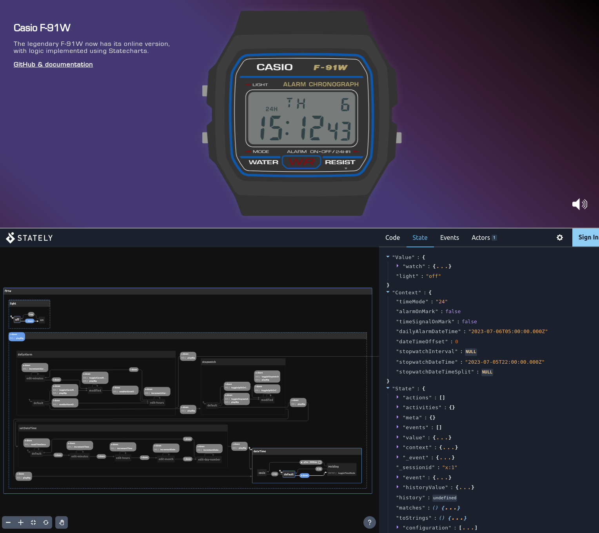

# Casio F-91W using Statecharts

> Online demo here: **[casio-f91w.pages.dev](https://casio-f91w.pages.dev)**

Interactive model of the Casio F-91W watch using statecharts.

## Intro

[Statecharts](https://statecharts.dev) are an extension of state machines, introduced by David Harel in 1987.
In the [paper](https://web.archive.org/web/20140828085002/http://www.wisdom.weizmann.ac.il/~harel/papers/Statecharts.pdf), Harel used a digital wristwatch as an example model.

I always thought it would be great to have an interactive demo that allows to see statecharts in action.
Unfortunately, that particular wristwatch (Citizen Quartz Multi-Alarm III) is now a rarity.

However, there is the iconic [Casio F-91W](https://en.wikipedia.org/wiki/Casio_F-91W), which despite being introduced only two years after the paper was published, remains widely popular and is still manufactured and sold today.
Alexis Philip created an [online version](https://github.com/alexisphilip/Casio-F-91W) digitizing the graphical elements.

This [demo](https://casio-f91w.pages.dev) builds on Alexis' work, demonstrates using statecharts by replacing the logic using the [XState](https://xstate.js.org/) library, and uses the Stately visualizer to show states and transitions side by side for educational purposes. You can also check out the [official manual](https://web.archive.org/web/20240310073811/https://support.casio.com/storage/en/manual/pdf/EN/009/qw593.pdf) for the watch.

## Differences & limitations

- Setting date and time is slightly different since it is represented using the builtin JavaScript Date object. Setting the day of week is therefore not used in the demo.
- Holding A button to continue incrementing time in alarm or date time setting is not implemented.
- You can set daily alarm time, but actual triggering the alarm is not implemented.

## Resources

- [Citizen watch statechart](https://github.com/andyjakubowski/statechart-watch) - similar statechart implementation of the original Citizen watch
- [Statecharts paper](https://web.archive.org/web/20140828085002/http://www.wisdom.weizmann.ac.il/~harel/papers/Statecharts.pdf) - original 1987 paper by David Harel
- [Casio F-91W manual](https://web.archive.org/web/20240310073811/https://support.casio.com/storage/en/manual/pdf/EN/009/qw593.pdf) - official manual for the watch

## Implementation

File structure:

- [demo/script](demo/script) - the original implementation, only the code for rendering is used
- [src/casio](src/casio) - contains statecharts-based implementation
  - [machine.js](src/casio/machine.js) - the XState machine definition
  - [machine.cljs](src/casio/machine.cljs) - implementation of machine actions
  - [xstate_service.cljs](src/casio/xstate_service.cljs) - helpers for using XState in ClojureScript
  - [statecharts_service.cljs](src/casio/statecharts_service.cljs) - wrapper for XState machine definition with [clj-statecharts](https://github.com/lucywang000/clj-statecharts)
  - [app.cljs](src/casio/app.cljs) - main app that runs the machine

## Development

Run `bb dev` to start the dev process (requires [Babashka](https://babashka.org/))

Open the app: http://localhost:8888/  
Run tests in browser: http://localhost:8888/test  
